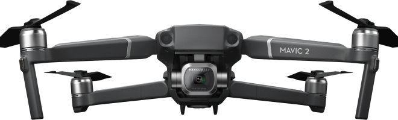

<div align="center">

# 🚁 DJI Mavic 2 Pro — Landing Page

**A hand-coded, pixel-crafted product landing page for the DJI Mavic 2 Pro with its Hasselblad camera.**

[](#)
[](#)
[](#)
[](#)
[](LICENSE)



</div>

---

## 🚀 What is this?

A single-page **product landing** for the DJI Mavic 2 Pro drone, built by hand from scratch — no page builder, no template. It's a front-end craft piece: semantic HTML, a structured SCSS architecture, a full-page section-scroll experience, an image carousel, and a fully responsive layout down to mobile.

## ✨ Highlights

- 🎯 **Full-page scroll** — section-by-section navigation via [fullPage.js](https://alvarotrigo.com/fullPage/)
- 🖼️ **Product carousel** — image slider powered by [slick-carousel](https://kenwheeler.github.io/slick/)
- 📐 **Structured SCSS** — split into `_vars`, `_fonts`, `_global`, `_libs`, `_media` partials
- 📱 **Responsive** — dedicated `_media.scss` breakpoints, mobile logo swap
- ⚙️ **Gulp pipeline** — SCSS compile + autoprefix + minify, JS concat + uglify, live reload via BrowserSync
- 🅰️ **Custom typography** — self-hosted SF Pro Display web fonts

## 🏗️ Project structure

```
app/
├── index.html
├── scss/              # source styles (compiled → app/css)
│   ├── style.scss     # entry: imports the partials below
│   ├── _vars.scss     # colors, breakpoints
│   ├── _fonts.scss    # @font-face declarations
│   ├── _global.scss   # base + component styles
│   ├── _libs.scss     # library overrides
│   └── _media.scss    # responsive breakpoints
├── js/
│   ├── main.js        # slider + fullpage init
│   └── libs.min.js    # bundled vendor scripts
├── css/               # build output (min.css)
├── fonts/             # SF Pro Display woff2
└── images/            # product art, backgrounds, icons
gulpfile.js            # build & dev pipeline
```

## 🛠️ Tech stack

`HTML5` · `SCSS` · `JavaScript` · `Gulp 4` · `fullPage.js` · `slick-carousel` · `BrowserSync`

## ▶️ Run locally

```bash
git clone https://github.com/simeonkolchin/dji-mavic-landing.git
cd dji-mavic-landing
npm install
npx gulp        # compiles SCSS/JS and serves with live reload
```

> **Note:** the Gulp toolchain (Gulp 4 + gulp-sass 4) targets an older Node runtime. If `npm install` fails on a recent Node version, install via [nvm](https://github.com/nvm-sh/nvm) with Node 14, or simply open `app/index.html` directly in a browser — the compiled `app/css/*.min.css` is already committed, so the page renders standalone.

## 📄 License

MIT © [Simeon Kolchin](https://github.com/simeonkolchin)
